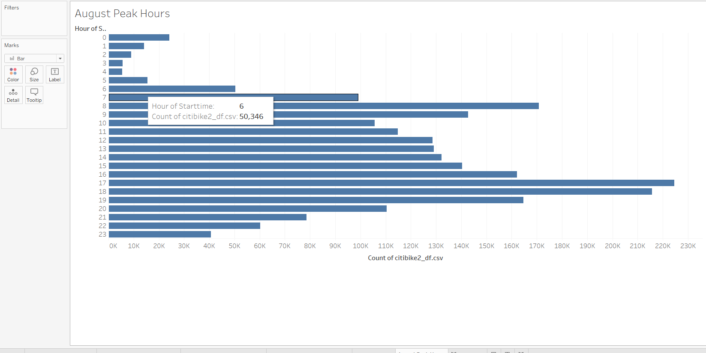
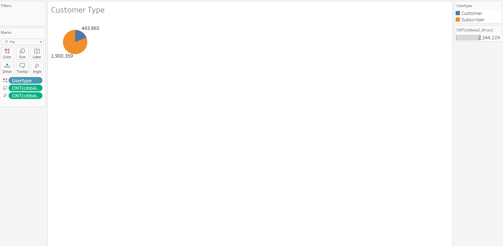
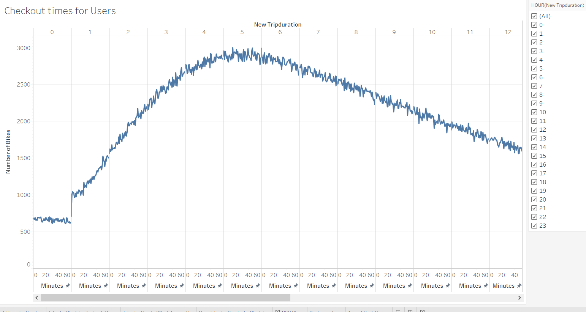
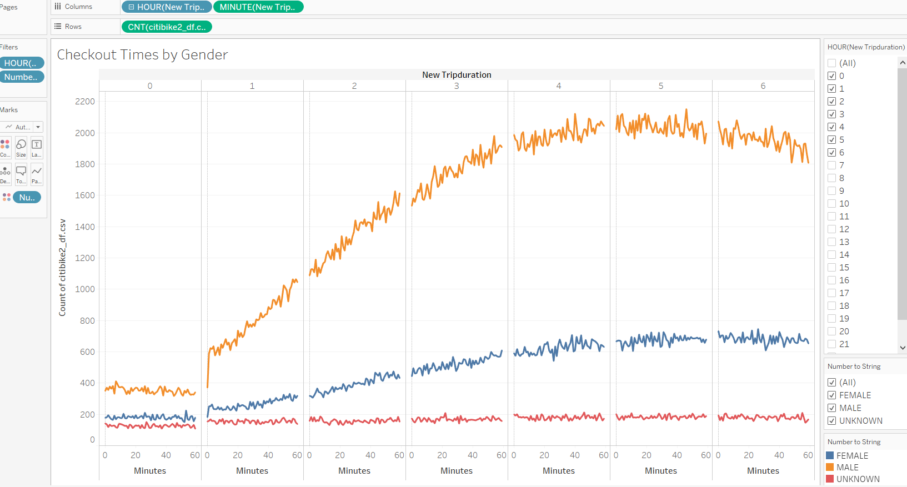
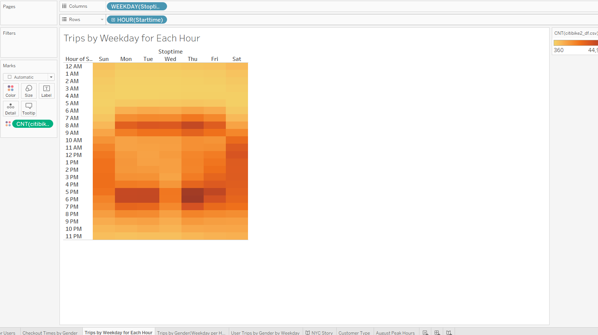
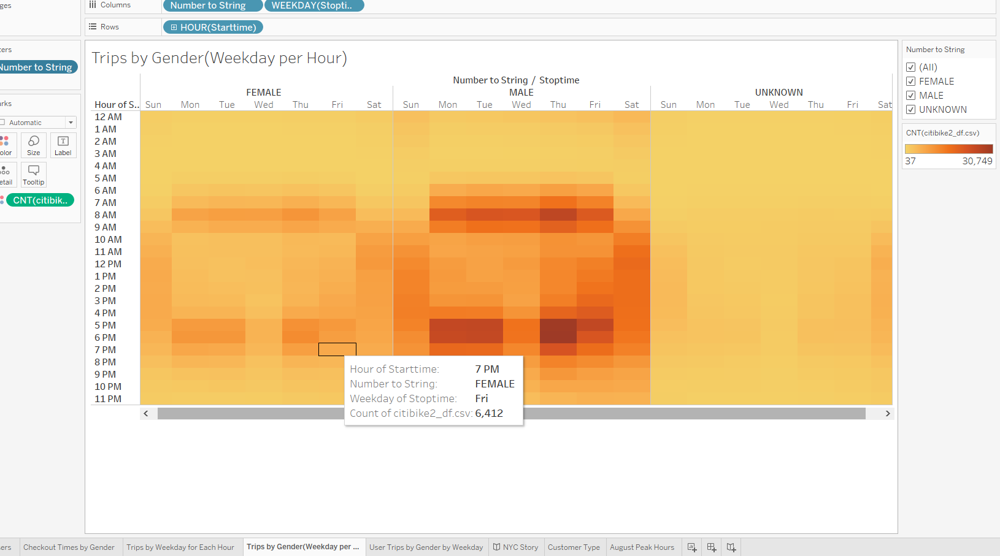
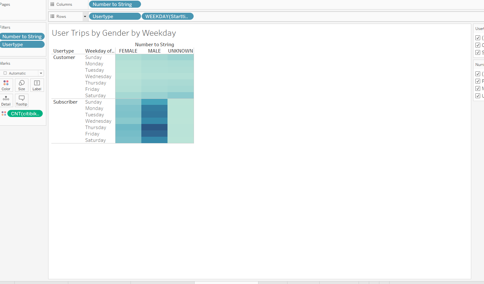

# bikesharing

## Link to Tableau profile

https://public.tableau.com/views/module14_16103261417140/NYCStory?:language=en&:display_count=y&:origin=viz_share_link

## Overview of Analysis

Creating a bike trip analysis to convince investors that a bike-sharing program in Des Moines is a solid business proposal. We will uses Pandas to change the "tripduration "column from an integer to a datetime datatype. We will create the following visualizations:
- Show the length of time that bikes are checked out for all riders and genders.
- Show the number of bike trips for all riders and genders for each hour of each day of the week.
- Show the number of bike trips for each type of user and gender for each day of the week.

With these new visualizaions we can make a story to pitch to the investors.

## Results

### August Peak Hours

The visualization from above shows August's Peak hours. It comes at no suprise that 0800 and 1700 are the peak hours. People are getting to places around 0800 and leaving that place around 1700. From 0900-1500 its a constant decrease in riders as people could be at work or school. 

### Customer Types

We can see that the most users are subscribers. With over 50% of total count being subscribers, it could be used as a positive since if customers are subsribing then they are happy with the service.

### Checkout Times by Users

This visualization explains how many bikes are used per hour of the day and how long they are used for. The data shows that users are using the bikes for 3-6 hours. With the range of users being from 2500 and above.

### Checkout Times by Gender

This data is similar to the previous one. The only thing is that it is categorized by Gender. Male is the dominant user of the bike service, this can be used when targeting users. 

### Trips by Weekday, by gender, by weekday for each hour and gender by weekday.

  

The 3 above visualizations are all similar with all of them wtih different aspects to it. The first is more of a general data visualization, gathering all the trips and creating a heatmap of the busiest weekday by hours. The second image breaksdown the data by gender and you are able to filter by whatever gender. The third image goes more into detail by giving us a visual of each gender and each user type by gender.It shows us which user's gender has a stronger customer usage.

## Summary

In general, male subscribers had the most outcome. But both female and males of both usertypes had strong number of riders especially during the hours of 0800 and 1700. While there was more males, targeting both genders equally can have a greater impact.

For future analysis :

- We can use the maintance data to see when the best hours are for maintance against the peak hours. 
- Gather more data on the users, i.e. get their roles, are they students/full time workers.
- Comparing NYC to Des Moines, how many are riders but also own cars, is there posibility that drivers are trying to save money and time by riding due to the high traffic in NYC. 
